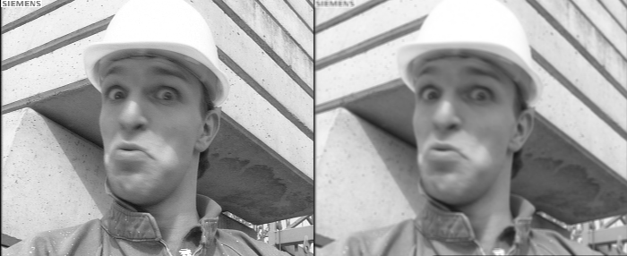
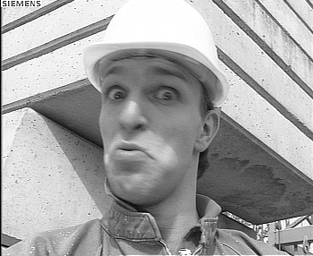

# Jotnar: a compiler for geometric assembly AI programs

Write AI programs once in geometric assembly — a small shader-like ISA
over typed streams — and compile them to **C** (portable, 20x over the
reference), **CUDA** (kernels + cuBLAS on the GPU), or **integer-only C**
(bit-exact, no FPU, no libm). Python frontend included: build programs
with `chain.builder` instead of hand-writing listings. Every backend is
gated against the others; agreement is leveled (bit-exact where
integer, epsilon where float, decisions where saturated).

```
python3 demo_img.py                 # image pipeline on 3 backends + gallery/
python3 demo_gen.py alexander the great --n 12 --backend cuda   # the LLM speaks
python3 tests/test_emit_c.py tests/test_emit_cuda.py tests/test_emit_nonfpu.py
```

## Showcase

One 43-op program (`programs/img_demo.asm`, builder-generated),
three backends. Before|blur strip and unsharp mask:




Agreement on 352x288 real pixels: CUDA-vs-C ~1e-4, non-FPU-vs-C
PSNR 56-69dB (lattice-quantum floor). The same toolchain also runs the
word-level transformer (`demo_gen.py`): identical strings on
lattice/C/CUDA/non-FPU.

## Opcode table (47 mnemonics)

Kinds: F float, T lattice-triples, I integer. Backends admit per-kind
overloads; missing = loud `NoPattern`, never silent.

| Op | In -> Out | C | CUDA | non-FPU | Notes |
|---|---|---|---|---|---|
| ADD | 2 -> 1 | F | F | T | |
| ARGMAX | 2 -> 1 | T,F | F | T | ties-first; lattice order on T |
| BATCH_MATMUL | 2 -> 1 | F | F/cuBLAS | T | |
| BETA | 1 -> 1 | F | F | T | const fill from CONFIG |
| BETA_V5 | 2 -> 1 | — | — | — | vision legacy |
| CLIP | 3 -> 1 | — | — | — | |
| CONCAT | 3 -> 1 | F,T | F | T | ax1 |
| CONV | 2 -> 1 | — | — | — | phi_conv audit-first |
| DECONV | 4 -> 1 | — | — | — | |
| DIV | 2 -> 1 | — | F | — | template op=3 |
| GAIN | 3 -> 1 | — | — | — | |
| GATHER | 2 -> 1 | T,F | F | T | rows materialized + views |
| GAUSS | 3 -> 1 | — | — | — | |
| GELU | 1 -> 1 | — | — | — | |
| INTERP | 3 -> 1 | — | — | — | nearest-x2 audited |
| ISO_BLUR | 1 -> 1 | — | — | — | |
| LAYERNORM | 3 -> 1 | — | — | — | shares RMSNORM scaffolding |
| LUMA | 1 -> 1 | — | — | — | |
| MATMUL | 2 -> 1 | F/BLAS | F/cuBLAS | T | ikj+restrict; GSL hook |
| MIXDYAD | 3 -> 1 | — | — | — | |
| MUL | 2 -> 1 | F | F | T | tmul-exact on T |
| PERMUTE3 | 4 -> 1 | — | — | — | meta (strides, zero code) |
| POOLAVG | 1 -> 1 | — | — | — | |
| PRELU | 2 -> 1 | — | — | — | k_leaky audit donor |
| RESCALE | 2 -> 1 | — | — | — | |
| RESHAPE2/3 | 3/4 -> 1 | — | — | — | meta |
| RMSNORM | 2 -> 1 | F | F | T | eps via CONFIG/baked counts |
| ROTARY | 2 -> 1 | F | F | T | tables baked at compile time |
| SCAN | 3 -> 1 | — | — | — | mamba path |
| SELECT | 3 -> 1 | F,T | F | T | runtime count guard |
| SIGMOID | 1 -> 1 | — | — | — | LUT spans ahead |
| SILU | 1 -> 1 | — | — | — | = x*sigmoid |
| SLICE | 4 -> 1 | F,T | F | T | ax0/ax1 |
| SOFTMAX | 1 -> 1 | — | — | T | legacy narrow path |
| SOFTMAX_WIDE | 1 -> 1 | F | F | T | online/stable; T via EXP LUT |
| SPLAT_BLUR | 1 -> 2 | — | — | — | vision legacy |
| SQRT | 1 -> 1 | — | — | — | |
| SQUARE | 1 -> 1 | — | — | T | tmul-self + clip |
| SRGB_DECODE/ENCODE | 1 -> 1 | — | — | — | |
| STATIC | 1 -> 1 | — | — | — | |
| SUB | 2 -> 1 | F | F | T | |
| TBETA | 1 -> 1 | F | F | T | head-temp fill |
| TRANSPOSE | 1 -> 1 | F,T | F | T | 2D (tiled later) |
| TSHIFT | 1 -> 1 | F | F | T | row-max; fuses into softmax |
| WARP | 2 -> 1 | — | — | — | |

Coverage: C 17, CUDA 18, non-FPU 19. Missing ops fail loud with the
extension recipe (`chain/backends.py`); vision Tier-3 and activations
are named backlog, not gaps.

## Quick start (compiler)

```
python3 tests/test_emit_c.py        # C backend: bigram bit-exact, headt block, BLAS hook
python3 tests/test_emit_cuda.py     # CUDA backend (needs nvcc + GPU)
python3 tests/test_emit_nonfpu.py   # integer backend (trap-clean, no libm)
python3 tests/test_img_demo.py      # one image program, three backends
python3 tests/test_gen.py           # LLM generation, four backends, golden string
python3 tests/test_builder.py tests/test_builder_block.py   # Python frontend
python3 demo_img.py                 # gallery/ screenshots
python3 demo_gen.py "alexander the great" --n 12 --backend nonfpu
```

Contract: missing ops/backends fail loud (`NoPattern`); float paths
agree within calibrated eps; integer paths agree bit-exactly;
saturated regions agree on decisions (`docs/THEORY_SPECTRAL.md` v0.5:
leveled agreement). Adding a backend = five methods
(`chain/emit_c.py:Backend`); adding an opcode = registry row + shape
rule + one pattern per backend.

## Research program (history)

Jotnar grew out of `holographic_enhancement` (true-amplitude holographic
enhancement, below) into an assembly language for composing geometric AI
structures — every operation an explicit integer op on lattice values or
a frozen LUT built offline, every program a listing, every claim a gate.

One-line history: old `holographic_enhancement` claimed `A=sqrt(I)` but never took a
square root; this repo actually does `A=sqrt(Y)` via exponent-halve, blurs in
amplitude domain, boosts, and squares back with exact `tmul`.

## Results (research gates, all green at merge)

Check | Result
---|---
`test_core.py` | ALL OK (sqrt-real, tmul, conv-orderfree, rescale-exact, tag-mismatch, hue basis, c-vectors incl. sig)
`test_parity.py` | ALL OK (synthetic 68/65dB, foreman 65dB, hue-preserved 0.000, alpha-ablation gated)
`test_c.py` | ALL OK (shared table + conv + splat file-exchange + v4 gates + float trap)
`test_c_conv.py` | ALL OK (4 cases bit-exact, not dB: fig/flat/corner/noise)
`test_matmul_c.py` | ALL OK (5 cases bit-exact: small/batched/broadcast/big-m/zeros)
`test_matmul_cuda.py` | ALL OK (3-way numpy/C/CUDA bit-exact, same 5 cases; SKIPs without nvcc)
`test_units_cuda.py` | ALL OK (k_conv_rep 4 cases + k_mux/clamp bit-exact vs C twins; SKIPs without nvcc)
`test_flagship_cuda.py` | ALL OK (full splat_soft+v5 A->YENH on CUDA bit-exact: synth/real/big-m)
`test_emit.py` | ALL OK (substrate matrix: flagship numpy/C/CUDA exact + dispatch log; xf numpy + loud C/CUDA refusals; bogus names refused)
`test_census.py` | ALL OK (planted fan-out exact, control empty, 42/42 classified, flagship/xf/stabilize maps pinned incl. STATE versions)
`test_probe.py` | ALL OK (sham exact, D 38dB in [20,45], COH falsified 44dB then held-out 43dB, xf O/DOWN, 11-stream sweep in 4 exact classes, stabilize W static 27dB + motion exact; probe table)
`test_modify.py` | ALL OK (modification demo: iso variant bit-exact vs chain, differs 45dB from v5, census shows new structure)
`test_edits.py` | ALL OK (weight-edit routes: matrix ordering V>MLP>Q, channel spread 15.6dB, scale-linearity, rank-monotone, direction spread 51.4dB basis-independent; standard process)
`test_realw.py` | ALL OK (Qwen2-0.5B L0 MLP on real weights+embeddings: parity 51.82dB, spectrum 17x, direction spread 33dB, planted recovery exact, blind predict 0.22dB; SKIPs without HF cache)
`test_implant.py` | ALL OK (rank-1 implant with functional aim: target token rewritten at negative dB, leads field by 26-35dB on target + held-out; structure transfer 36.8dB quantum-tax bounds; SKIPs without HF cache)
`test_store.py` | ALL OK (directional stores: sham 99.8dB, listing-vs-surgery 91.2dB, bank-vs-matmul 96.1dB toy, stdlib DEFs resolve)
`test_storebank.py` | ALL OK (native banks on real weights: parity 55.8dB, pruned 42.7 vs 42.9 predicted; SKIPs without HF cache)
`dd_mine.py` / `dd_footprint.py` | research one-shots (DDColor 100-query mining: vote maps diffuse, footprints bite -- q39 dark-region 3.7x; needs HF cache + ddcolor checkout)
`dd_catalog.py` | full palette catalog in 28s (docs/PALETTE_CATALOG.csv: hue + mass + causal dB per query; statics beat dynamics as predictor)
`dd_modify.py` | ADD demo + disentangle modes (query-only 36dB / refine-only 19dB / both 14.5dB: slot = place+color pair; see #LIB-067)
`dd_demo1.py` | v1.5 demo 1 GREEN: coordinated 5-slot teal write, energy x1.25, global -3.7dB, receipt #002 (9 designs, 8 falsified, see #LIB-074)
`test_demo2.py` | v1.5 demo 2 GREEN: content-addressable memory from scratch (16 patterns, no trained weights) recalls 100% at 0/8/16 flips
`test_demo3.py` | v1.5 demo 3 GREEN: two consecutive correct edit previews (base/halved/fresh stores all 100% @8 flips; same listing, data-only edits)
`gallery/` | v1.5 figures, all eyeball-verified: palette_wheel (100 queries by hue+share), teal_before_after (visible teal boost), flagship/ (6 modes + internals), recall_curve (cliff at ~20 flips)
`docs/HANDOFF_LLM.md` | v1.9 readiness: map + capability inventory + per-subsystem feasibility (GO with gaps named) + first-week plan
`research/` | one-shot research scripts (readouts, loops, miners) with evidence in docs/ -- rerun to verify, not to gate (see research/README.md)
`dd_resonant.py` | resonant-phase probe: scalar + H=8 signatures both scramble (~chance); bridge restated for scalar attributes, not key vectors
`test_read.py` | ALL OK (read instrument: table shape, query plumbing, token-effect spread, shelf-map logic, factor form, predictor logic; real 112-dir readout in docs/MODEL_READ.md)
`test_prune.py` | ALL OK (CRUD Q1+Q2: 27-dir removal 42.8 vs 42.9 predicted; gain-x2 == ablation at 22.1dB; SKIPs without HF cache)
`test_create.py` | ALL OK (CRUD Q3+Q4: label-to-store France rank 1/8 at 8.4dB gap 22.6; shelf-null 57.8dB; SKIPs without HF cache)
`test_projbank.py` | ALL OK (v1.4 gate 1: 6/6 projection banks 59-63dB; prune harmless 76.1dB with floor hypothesis; SKIPs without HF cache)
`test_select.py` | ALL OK (v1.4 gate 2: S08 first instance -- P-invariance bit-exact, recompose 82.9dB, top-beats-bottom ordering)
`test_anatomy.py` | v1.6: SmolLM2 48.9dB two-stage + GPT-2 LN-GS 57.9dB with DOWN measured 19.9dB (cancellation law); SKIPs without HF cache (see docs/LLM_DESIGN.md)
`test_lm.py` | v1.6 construction: bigram LM from frozen counts (no trained weights) memorizes 200/200, held-out top1 0.41/top5 0.61/ppl 47
`test_lm_loop.py` | v1.6 gate 4: loop on own creature -- 26/26 column-silence flips exact, 5/5 implants predicted (creation with guarantee)
`demo_lm.py` | our LLM speaking through the listing (greedy; try `python3 demo_lm.py alexander the great --n 30 --topk 12 --seed 7 --no-repeat 3 --cand 6` for sampled: seeded replay identical, diversity gated in test_lm.py)
`test_mamba.py` | v1.6 anatomy-mamba: real selective-scan trajectory 46.3dB via repeat-threading (abar/h/Bx ranges reported; SKIPs without HF cache)
`test_asm.py` | incl. SCAN drill (0-diff, float parity, repeat==manual) + LAYERNORM exposure (44 mnemonics; see docs/LANGUAGE.md)
`test_tshift.py` | T-transform follow-through: TSHIFT + SOFTMAX_WIDE (89dB on +-500 scores, vendor 0-diff, legacy untouched; 46 mnemonics) -- MERGED to phi-core origin/main (af4e3c0), vendored copy redundant-but-green
`test_lm_block1.py` | single-head LM block (GATHER emb + RoPE + TSHIFT+WIDE + SwiGLU + unembed): hidden 71.19dB, logits 83.84dB, deterministic
`test_lm_block2h.py` | H=2 via SLICE/CONCAT repeats (Dh=8): hidden 74.29dB, logits 87.21dB (smaller K buys floor, law confirmed)
`test_lm_depth2.py` | depth-2 weight-tied: hidden 70.91dB, logits 83.66dB (-3.4dB compounding, naive sum holds)
`test_lm_depth2causal.py` | causal depth-2 + twin orders (active S=3 47.7dB, passive S=5 40.6dB thin-but-green; S=8 stress 51-53dB, margin was content not length)
`test_causal.py` | causal mask as structure (SELECT+BETA, no new mnemonics): future-blocked ~0, past bit-exact under future perturbation, reversal 0.45, torch 82.4dB
`test_lm_svd.py` | counts-injected transformer (log1p-bigram rank-16 SVD, spectrum 7.3x, m_acc 35492+m_cov 35048): parity 59.7/60.4dB, top1 0.325 (random 0.0), ppl 95 (random 512, bigram 47)
`demo_deep.py` / `demo_retrieve.py` | retrieve-then-generate bridge: cue -> assoc recall -> prepend -> causal LM (active exact e0003, passive exact e0019 post combiner fix)
`test_edge_store.py` | 55 Echion edges -> 68 keys (8 twin order-pairs) + 138-lexicon: recall 1.00/1.00/0.99 @0/8/16, twin-same-value exact
`test_retrieve.py` | 16/16 voice cues retrieve twin-tagged edges through the listing (GATHER triples assert hardened en route)
`test_bpe_asm.py` | BPE in assembly: decode rows exact, splice step bit-exact, driver-loop == host encode (full cascade waits on shrink-geometry design; see docs/BPE_SPEC.md)
`test_twin_print.py` | causal H4-last-row fingerprints: reversal 0.877 sensitive, twin 0.845 measured-not-barred (invariance waits on non-random weights)
`test_assoc_cos.py` | cosine retrieval as structure (RMSNorm equalize + MATMUL + ARGMAX, m_acc 36230 priced): 14/16 tag-exact through the listing, host ceiling matched (dot was 2/16 norm-biased); v07 ambiguity stated
`test_cuehidden.py` | cue projection H@P listing (69.3dB) + hidden-cue baseline 2/16 measured-not-barred (gap to close; word-cues 16/16)
`docs/BPE_SPEC.md` | subword bridge spec: 2000 merges V=2038, roundtrip 0 mismatches, OOV 0/14399; word-2k autopsy (top1 0.252/ppl 390: coverage w/o concentration) + bigram-pieces mismatch (0.035: context-order) recorded
`data/lm_svd_IvoQ.npz` | word-order stack: identity-V (wv=wo=I*0.5: dist 0.858/top1 0.341) + similarity-QK (wq=wk=I*0.2: dist 0.832/top1 0.354, scoremax 0.527 in-contract); gains/seeds/MLP moves rejected-with-reason in manifest (blur, collapse, overfit)
`test_lm_bankhn.py` | counts-structured DOWN: layer-1 MLP replaced by softmax storebank over 128 next-word stores (HN@ukt->WIDE->@evb, m_acc 36118 priced): twin_dist 0.781, top1 0.350 no-collapse, parity 54.5/53.5 (MID-space bank failed first: content-free space, re-grounded in emb-space)
`test_lm_headt.py` | head specialization (47th mnemonic TBETA, head2 T=4 fitted, head1 control): twin_dist 0.700, top1 0.350, parity 52.3/52.5 (drift gate fired 46/47, greened on documenting)
`test_lm_bankhn2.py` | both-layer bank MLP (tied stores, last random structure gone): twin_dist 0.743, top1 0.350, parity 53.5/53.1 -- every matrix counts-derived or content-structured
`docs/T_TRANSFORM.md` | v1.4 gate 4: full-range attention specified (fold obstruction, 9-layer ranges, one-assert phi-core fix + our composition; DDColor L0 needs m_of(~16))
`test_layer1.py` | ALL OK (CRUD Q5: layer-1 pattern reproduces -- spectrum 12x, giant 14dB, tracking -0.54; SKIPs without HF cache)
`test_engram.py` | ALL OK (native storage: freeze/load roundtrip 6.4e-16, deterministic bytes, store-IO bit-exact; DDColor query/refine stores frozen; SKIPs without HF cache)
`docs/EDIT_RECEIPT.md` | edit-receipt standard + filled receipt #001 (q56 hue-write SPLIT)
`test_splat_c.py` | ALL OK (full splat_blur bit-exact incl. buckets, both C modes: 6 compositional + 2 fused cases)
`test_splat.py` | ALL OK (4 orientations 1.00, halo<=iso, blur parity 41dB, agreement 0.99, e2e 43dB, fusion-exact bit-identical)
`test_ctrl.py` | ALL OK (file validity, hash, real-frame parity ~43-50dB, rotation-invariant gap 0.04, flat identity)
`test_depth.py` | ALL OK (cache determinism, parity 45.68dB, near p99 3.6x far, toggle-clean)
`test_v4.py` | ALL OK (noise 40.27dB BARRED, real 52dB, structured 55dB, rotation 0.04, flat, sharpens)
`test_v5.py` | ALL OK (grain 47.95dB barred, real 47.61, structured 50.43, rotation 0.04, detail-order, noise measured 37.10)
`test_substitute.py` | ALL OK (sigmoid swaps numpy<->torch/CUDA exact on 2007 triples; chain-swap bit-identical live 2x; replicate-vs-zero refusal characterized)
`test_asm.py` | ALL OK (flagship listing bit-exact vs chain + 4 discipline gates)
`test_stabilize.py` | ALL OK (flicker -26%, no smear, parity 64dB linear, static-exact, frame0-still)
`test_motion.py` | ALL OK (compass 14, rescue-V 0.36->0.81, zeroflow-exact bytes, pan-preserve, parity 42.94dB, pan-e2e ratio 0.504, rotation 0.04)
`test_temporal.py` | ALL OK (mix-frozen, warp-parity 73dB, warp-identity, static-converged + firststep bounds, firstframe-still, memory, step-settles, seq 64dB)
`test_router.py` | ALL OK (decisions incl. boundary, seamless-static exact, flicker-wins, sharpness-bounded, routed parity 60-63dB)
`test_xf_block.py` | ALL OK (v1.0 Gate 1: whole-block 84dB vs torch in-contract S=8/D=16/Dff=32; out-of-contract measured 14.6dB, mechanism stated)
`test_stranger.py` | ALL OK (v1.0 Gate 6: docs-only 5-line listing green first try + self-rescue errors; frictions -> docs/V1_1_BACKLOG.md)
`demo.py --selftest` | GO 68.5dB

## Quick start (research tree)

```
pip install -r requirements.txt
python3 chain/calibrate.py          # offline, freezes chain/M.json (m_acc + m_cov)
python3 scripts/fit_ctrl.py --write # offline, freezes chain/CTRL.json (5 params)
python3 tests/test_core.py                # expect ALL OK
python3 tests/test_parity.py              # expect ALL OK (>=40dB)
python3 tests/test_c.py                   # expect ALL OK (needs gcc; incl. conv+splat exchange, v4)
python3 tests/test_splat.py               # expect ALL OK (splats-lite)
python3 tests/test_ctrl.py                # expect ALL OK (beta-field controller)
python3 tests/test_depth.py               # expect ALL OK (needs DAV2 checkout + weights)
python3 tests/test_v4.py                  # expect ALL OK (continuity: noise barred)
python3 tests/test_v5.py                  # expect ALL OK (learned gate, grain barred)
python3 tests/test_substitute.py          # expect ALL OK (needs torch + rife checkout; cross-model swap)
python3 tests/test_asm.py                  # expect ALL OK (assembly fidelity + discipline)
python3 tests/test_stabilize.py            # expect ALL OK (generative proof: stabilizer listing)
python3 tests/test_motion.py               # expect ALL OK (motion side-channel consensus)
python3 tests/test_temporal.py             # expect ALL OK (feedback: detail IIR + warp)
python3 tests/test_router.py               # expect ALL OK (routing: still/temporal per frame)
python3 demo.py input.png output.png --beta 0.5 --blur splat --ctrl on
python3 demo.py input.png output.png --beta 0.5 --blur splat_soft --ctrl soft  # v4
python3 demo.py input.png output.png --beta 0.5 --blur splat_soft --ctrl v5    # v5
python3 showcase.py input.png /tmp/showcase  # all modes + internal states
```

## How it works

phi pipeline: sRGB --encode--> linear Y triples -> `sqrt_trip` (the missing
op) -> `conv_trip` integer blur @ m_acc -> `rescale_` -> `binop` detail @
m_cov -> `tmul` boost -> `tmul` square (`I=|A|^2`) -> `tdiv_trip` gain ->
`tmul` chroma-preserve -> --decode--> sRGB. See phi-core `IR.md`. Float only
at boundaries + offline.

Math executed: `A=sqrt(Y); As=blur(A); Aenh=A+beta_eff*(A-As); Ienh=Aenh^2`,
where blur is iso-Gaussian, the splat bank (hard mux / fused / relu-blend),
and beta_eff is scalar, the v3 decision field, the v4 sigmoid field, or the
v5 learned gate (1x1 on coh + detail magnitude, fitted offline, frozen).
Library notes live in docs/LIBRARY_NOTES.md (kept while using the library:
#LIB-001..028). Language reference: docs/LANGUAGE.md (every mnemonic +
tutorial + contribution process). Velocity log: docs/VELOCITY.md. Specs: docs/SPLAT_OP.md, docs/BETA_CTRL.md, docs/COMPOSE.md
(step 3a depth built L1; temporal + L2 stay spec), docs/PROGRESS.md.

## Showcase history (research tree, seeing every state)

`showcase.py` runs iso / splat / splat+ctrl / v4-soft / v5-gate / strong on
one image, checks parity per mode, asserts the modes actually differ, and saves:

* `out_*.png` -- one output per mode,
* `st_amplitude/structure/detail/buckets/coherence.png` -- internals of the
  flagship config (wave, structure, ripple, 5-color orientation map,
  coherence heat),
* `sheet_states.png`, `sheet_modes.png` -- labeled contact sheets.

On f_012: input sharp 714 -> iso 1350 -> splat 1178 -> splat+ctrl 1092 ->
v4-soft 1108 -> v5-gate 1294 -> strong 1520. v5 recovers sharpness selectively
(1.36 LSB mean change vs iso's 1.90): the detail gate spends boost where
detail lives.

## Debt log (addressed earlier rounds)

1. Two scales: `m_acc` (products) + `m_cov` (values), `rescale_` is the only
   scale changer (fixed@m1->fixed@m2, mirrors `fq_rescale`). Mixing without
   it raises. Fixed one real saturation bug found at 13dB.
2. Alpha removed: parabola was hiding noise/clipping; amplitude math +
   integer gain-clip [0.5,2] + out-clip [0,1] handle both honestly.
   `--alpha` keeps the ablation, still parity-gated.
3. Boundary hardened: Rec.709 luma fingerprinted (sum 1.0), hue-preservation
   gated off-rail (0.000 drift).
4. C lowering: `c_chain/` sqrt/mul + `holo_conv` (replicate-edge, accum
   @ m_acc, `rescale_` to m_cov, schedule oy-ox-ky-kx recorded in header) +
   shared vector table incl. the floor-div edge (d=-3 -> -2) +
   file-exchange parity (4 cases BIT-EXACT, not dB) + `make trap` clean.

## License

GPLv3.
